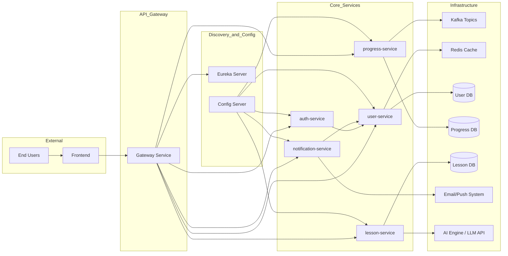

# 📘 QuantiLearn

**QuantiLearn** is an adaptive e-learning platform that dynamically adjusts lesson difficulty and study plans using AI. The backend is powered by Spring Boot microservices with Kafka, Redis, Docker, and AWS for scalable deployment.


## 🧩 Microservices Overview

### ✅ auth-service
- Handles user authentication using JWT.
- Issues and validates tokens for secure communication.

### 👤 user-service
- Stores user profile data.
- Integrates Redis caching to reduce latency and improve performance.

### 📊 progress-service
- Tracks user progression (lesson completion, time spent, scores).
- Will use Kafka to asynchronously process and broadcast progress updates.

### 🔔 notification-service
- Sends reminders and alerts via email or push notifications.

### 📚 lesson-service
- Stores and serves educational lessons and metadata.
- AI Integration: Generates personalized lesson plans based on user progress, performance history, and learning preferences.
- Can utilize models via Spring AI or integrate external LLM APIs (e.g., OpenAI, Claude, or Hugging Face).

## 🌐 System Architecture


## 🛠️ Tech Stack
| Component           | Technology                        |
|---------------------|-----------------------------------|
| Frontend            | Angular, HTML, CSS                |
| Backend             | Spring Boot (Java)                |
| Auth                | JWT                               |
| Database            | PostGreSQL, MongoDb               |
| Messaging           | Apache Kafka                      |
| Caching             | Redis                             |
| Service Discovery   | Eureka Server                     |
| API Gateway         | Spring Cloud Gateway              |
| Config              | Spring Cloud Config Server        |
| Containerization    | Docker, Kubernetes                |
| Deployment Platform | AWS (EC2, RDS, S3, EKS)           |
| AI Integration      | Spring AI (OpenAI or Hugging Face)|

## 🚧 Development Roadmap
 - Build and deploy auth-service, user-service, progress-service

 - Redis integration in user-service

 - Kafka event handling in progress-service

 - Develop lesson-service and notification-service

 - Setup service-register, config-server, and gateway

 - Create Angular frontend

 - Dockerize all microservices

 - Deploy using Kubernetes

 - Migrate entire stack to AWS Cloud

## 🚀 Getting Started
**Prerequisites**
- Java 17+
- Maven
- Docker & Docker Compose
- Kafka, Redis
- Spring Cloud dependencies
  
**Clone Repository**
 ```bash
git clone https://github.com/sanjay872/QuantiLearn.git
cd QuantiLearn
```
**Run Microservices**
Each service is in its own directory. Navigate to the folder and run:
```bash
./mvnw spring-boot:run -Dspring-boot.run.profiles=dev
```
Or use Docker:
```bash
docker-compose up --build
```
**API Access**
Use the gateway once integrated:
```bash
http://localhost:8080/api/{service}/...
```

## 💡 Contribution Guidelines
- Fork and clone the repository.

- Make changes in feature branches.

- Submit pull requests with proper documentation.

- Report bugs and request features via GitHub Issues.

## 📜 License
This project is licensed under the MIT License.

## 🙋‍♂️ Author
Sanjay Sakthivel
Feel free to raise issues or contribute to this project on GitHub.
